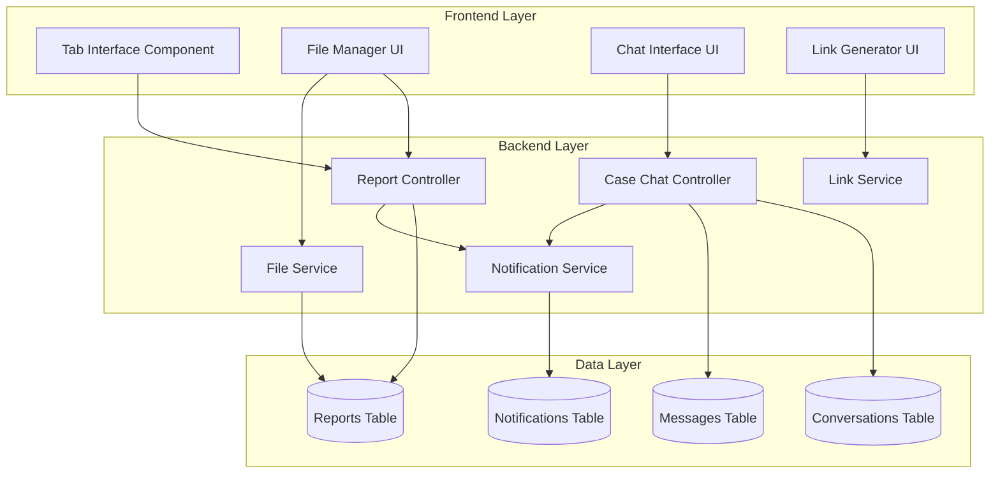
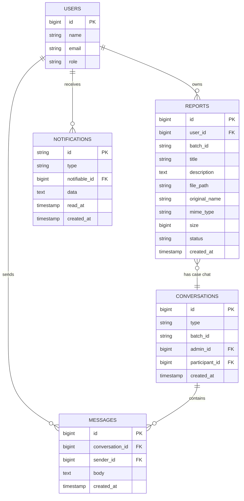

# Design Document: Case Detail Tabs Enhancement

## Overview

This design document specifies the technical architecture for enhancing the case management system with a tabbed interface. The enhancement introduces three distinct tabs (Files, Case Notes, and Client Chat) to organize case information, enable additional file uploads to existing cases with shareable links, and provide case-specific communication between clients and staff.

The system is built on Laravel 10 with Blade templates for server-side rendering. The existing architecture uses a batch-based approach where multiple files can be grouped under a single case using a `batch_id`. The enhancement extends this architecture to support:

1. A tabbed interface for organizing case information
2. Additional file uploads to existing cases
3. Shareable file links with access control
4. Case-specific chat functionality isolated from the existing general chat system
5. Real-time updates using polling
6. Responsive design for mobile devices

### Key Design Decisions

- **Tab State Management**: Use URL hash fragments for tab persistence and deep linking
- **Chat Isolation**: Create a separate conversation type (`case_chat`) to isolate case-specific messages from general conversations
- **File Links**: Generate signed URLs with embedded batch_id for secure file sharing
- **Real-time Updates**: Use AJAX polling (5-second intervals) for chat updates to maintain simplicity and avoid WebSocket infrastructure
- **Mobile-First**: Design tabs with horizontal scrolling and responsive layouts

## Architecture

### System Components



### Component Responsibilities

**Tab Interface Component**
- Renders three tabs: Files, Case Notes, Client Chat
- Manages active tab state using URL hash
- Handles tab switching without page reload
- Displays notification badges for unread messages

**File Manager UI**
- Displays all files associated with a case
- Provides upload interface for additional files
- Shows file metadata (name, size, type, date)
- Generates shareable links for files

**Chat Interface UI**
- Displays case-specific messages
- Provides message input and submission
- Polls for new messages every 5 seconds
- Auto-scrolls to newest messages
- Renders file links as clickable elements

**Report Controller**
- Handles case detail page rendering
- Manages file uploads to existing cases
- Validates file access permissions
- Serves files via signed URLs

**Case Chat Controller**
- Creates and manages case-specific conversations
- Handles message sending and retrieval
- Enforces access control (case owner + staff only)
- Returns messages in JSON format for AJAX polling

**File Service**
- Stores uploaded files to storage/app/public/reports
- Associates files with batch_id
- Validates file size (max 512MB)
- Generates file metadata

**Link Service**
- Generates signed URLs for file sharing
- Embeds batch_id and file_id in URL
- Validates link access permissions
- Returns file download responses

**Notification Service**
- Sends notifications for file uploads
- Sends notifications for new chat messages
- Uses existing CaseActivity notification class
- Targets appropriate user roles

## Components and Interfaces

### Frontend Components

#### Tab Navigation Component

```javascript
// resources/js/components/CaseDetailTabs.js
class CaseDetailTabs {
    constructor(containerId, defaultTab = 'files') {
        this.container = document.getElementById(containerId);
        this.defaultTab = defaultTab;
        this.activeTab = this.getTabFromHash() || defaultTab;
        this.init();
    }
    
    init() {
        this.bindTabClicks();
        this.showTab(this.activeTab);
        window.addEventListener('hashchange', () => this.handleHashChange());
    }
    
    bindTabClicks() {
        const tabs = this.container.querySelectorAll('[data-tab]');
        tabs.forEach(tab => {
            tab.addEventListener('click', (e) => {
                e.preventDefault();
                const tabName = tab.dataset.tab;
                this.switchTab(tabName);
            });
        });
    }
    
    switchTab(tabName) {
        window.location.hash = tabName;
        this.showTab(tabName);
    }
    
    showTab(tabName) {
        // Hide all tab contents
        const contents = this.container.querySelectorAll('[data-tab-content]');
        contents.forEach(content => content.classList.add('hidden'));
        
        // Remove active state from all tabs
        const tabs = this.container.querySelectorAll('[data-tab]');
        tabs.forEach(tab => tab.classList.remove('active'));
        
        // Show selected tab content
        const selectedContent = this.container.querySelector(`[data-tab-content="${tabName}"]`);
        if (selectedContent) {
            selectedContent.classList.remove('hidden');
        }
        
        // Add active state to selected tab
        const selectedTab = this.container.querySelector(`[data-tab="${tabName}"]`);
        if (selectedTab) {
            selectedTab.classList.add('active');
        }
        
        this.activeTab = tabName;
        
        // Initialize chat polling if chat tab is active
        if (tabName === 'chat' && window.caseChatManager) {
            window.caseChatManager.startPolling();
        } else if (window.caseChatManager) {
            window.caseChatManager.stopPolling();
        }
    }
    
    getTabFromHash() {
        const hash = window.location.hash.substring(1);
        return hash || null;
    }
    
    handleHashChange() {
        const tabName = this.getTabFromHash() || this.defaultTab;
        this.showTab(tabName);
    }
}
```

#### File Upload Component

```javascript
// resources/js/components/CaseFileUpload.js
class CaseFileUpload {
    constructor(formId, batchId) {
        this.form = document.getElementById(formId);
        this.batchId = batchId;
        this.init();
    }
    
    init() {
        this.form.addEventListener('submit', (e) => this.handleSubmit(e));
    }
    
    async handleSubmit(e) {
        e.preventDefault();
        
        const formData = new FormData(this.form);
        formData.append('batch_id', this.batchId);
        
        try {
            const response = await fetch(this.form.action, {
                method: 'POST',
                body: formData,
                headers: {
                    'X-CSRF-TOKEN': document.querySelector('meta[name="csrf-token"]').content
                }
            });
            
            const data = await response.json();
            
            if (data.ok) {
                window.location.reload();
            } else {
                this.showError(data.message || 'Upload failed');
            }
        } catch (error) {
            this.showError('Network error occurred');
        }
    }
    
    showError(message) {
        // Display error message to user
        alert(message);
    }
}
```

#### Case Chat Manager

```javascript
// resources/js/components/CaseChatManager.js
class CaseChatManager {
    constructor(batchId, messagesUrl, sendUrl) {
        this.batchId = batchId;
        this.messagesUrl = messagesUrl;
        this.sendUrl = sendUrl;
        this.pollingInterval = null;
        this.lastMessageId = 0;
        this.init();
    }
    
    init() {
        this.messageContainer = document.getElementById('case-chat-messages');
        this.messageForm = document.getElementById('case-chat-form');
        this.messageInput = document.getElementById('case-chat-input');
        
        if (this.messageForm) {
            this.messageForm.addEventListener('submit', (e) => this.handleSend(e));
        }
        
        this.loadMessages();
    }
    
    async loadMessages() {
        try {
            const response = await fetch(this.messagesUrl);
            const data = await response.json();
            
            if (data.messages) {
                this.renderMessages(data.messages);
                if (data.messages.length > 0) {
                    this.lastMessageId = data.messages[data.messages.length - 1].id;
                }
            }
        } catch (error) {
            console.error('Failed to load messages:', error);
        }
    }
    
    async handleSend(e) {
        e.preventDefault();
        
        const message = this.messageInput.value.trim();
        if (!message) return;
        
        try {
            const response = await fetch(this.sendUrl, {
                method: 'POST',
                headers: {
                    'Content-Type': 'application/json',
                    'X-CSRF-TOKEN': document.querySelector('meta[name="csrf-token"]').content
                },
                body: JSON.stringify({ message })
            });
            
            const data = await response.json();
            
            if (data.ok) {
                this.messageInput.value = '';
                this.loadMessages();
            }
        } catch (error) {
            console.error('Failed to send message:', error);
        }
    }
    
    renderMessages(messages) {
        this.messageContainer.innerHTML = '';
        messages.forEach(msg => {
            const messageEl = this.createMessageElement(msg);
            this.messageContainer.appendChild(messageEl);
        });
        this.scrollToBottom();
    }
    
    createMessageElement(message) {
        const div = document.createElement('div');
        div.className = 'message';
        div.innerHTML = `
            <div class="message-sender">${message.sender_name}</div>
            <div class="message-body">${this.linkify(message.body)}</div>
            <div class="message-time">${message.created_at}</div>
        `;
        return div;
    }
    
    linkify(text) {
        const urlRegex = /(https?:\/\/[^\s]+)/g;
        return text.replace(urlRegex, '<a href="$1" target="_blank">$1</a>');
    }
    
    scrollToBottom() {
        this.messageContainer.scrollTop = this.messageContainer.scrollHeight;
    }
    
    startPolling() {
        if (this.pollingInterval) return;
        this.pollingInterval = setInterval(() => this.pollNewMessages(), 5000);
    }
    
    stopPolling() {
        if (this.pollingInterval) {
            clearInterval(this.pollingInterval);
            this.pollingInterval = null;
        }
    }
    
    async pollNewMessages() {
        try {
            const response = await fetch(`${this.messagesUrl}?since=${this.lastMessageId}`);
            const data = await response.json();
            
            if (data.messages && data.messages.length > 0) {
                data.messages.forEach(msg => {
                    const messageEl = this.createMessageElement(msg);
                    this.messageContainer.appendChild(messageEl);
                });
                this.lastMessageId = data.messages[data.messages.length - 1].id;
                this.scrollToBottom();
            }
        } catch (error) {
            console.error('Polling failed:', error);
        }
    }
}
```

### Backend Controllers

#### Case Chat Controller

```php
// app/Http/Controllers/CaseChatController.php
namespace App\Http\Controllers;

use App\Models\Conversation;
use App\Models\Message;
use App\Models\Report;
use App\Models\User;
use App\Notifications\CaseActivity;
use Illuminate\Http\Request;

class CaseChatController extends Controller
{
    public function messages(Request $request, $batchId)
    {
        $user = $request->user();
        
        // Verify access
        if (!$this->canAccessCase($user, $batchId)) {
            abort(403);
        }
        
        $conversation = $this->getOrCreateConversation($batchId);
        
        $query = $conversation->messages()
            ->with('sender')
            ->orderBy('created_at', 'asc');
        
        if ($request->has('since')) {
            $query->where('id', '>', $request->since);
        }
        
        $messages = $query->get()->map(function ($message) {
            return [
                'id' => $message->id,
                'sender_name' => $message->sender->name,
                'sender_id' => $message->sender_id,
                'body' => $message->body,
                'created_at' => $message->created_at->format('Y-m-d H:i'),
            ];
        });
        
        return response()->json(['messages' => $messages]);
    }
    
    public function send(Request $request, $batchId)
    {
        $user = $request->user();
        
        // Verify access
        if (!$this->canAccessCase($user, $batchId)) {
            abort(403);
        }
        
        $request->validate([
            'message' => 'required|string|max:5000',
        ]);
        
        $conversation = $this->getOrCreateConversation($batchId);
        
        $message = Message::create([
            'conversation_id' => $conversation->id,
            'sender_id' => $user->id,
            'body' => $request->message,
        ]);
        
        // Notify participants
        $this->notifyParticipants($conversation, $user, $batchId);
        
        return response()->json(['ok' => true, 'message' => $message]);
    }
    
    protected function canAccessCase($user, $batchId)
    {
        // Staff can access all cases
        if (in_array($user->role, ['admin', 'assistant', 'admin_assistant'])) {
            return true;
        }
        
        // Users can only access their own cases
        return Report::where('batch_id', $batchId)
            ->where('user_id', $user->id)
            ->exists();
    }
    
    protected function getOrCreateConversation($batchId)
    {
        return Conversation::firstOrCreate(
            [
                'type' => 'case_chat',
                'batch_id' => $batchId,
            ],
            [
                'admin_id' => null,
                'participant_id' => null,
            ]
        );
    }
    
    protected function notifyParticipants($conversation, $sender, $batchId)
    {
        $report = Report::where('batch_id', $batchId)->first();
        
        if (!$report) return;
        
        // Notify case owner if sender is staff
        if (in_array($sender->role, ['admin', 'assistant', 'admin_assistant'])) {
            $report->user->notify(new CaseActivity($report, 'message_received'));
        } else {
            // Notify all staff if sender is client
            $staff = User::whereIn('role', ['admin', 'assistant', 'admin_assistant'])->get();
            foreach ($staff as $person) {
                $person->notify(new CaseActivity($report, 'message_received'));
            }
        }
    }
}
```

#### Enhanced Report Controller Methods

```php
// Additional methods for app/Http/Controllers/User/ReportController.php

public function uploadAdditional(Request $request, $batchId)
{
    $user = $request->user();
    
    // Verify ownership
    $existingReport = Report::where('batch_id', $batchId)
        ->where('user_id', $user->id)
        ->first();
    
    if (!$existingReport) {
        abort(404);
    }
    
    $request->validate([
        'files' => 'required|array',
        'files.*' => 'file|max:512000',
    ]);
    
    $uploadedFiles = [];
    
    foreach ($request->file('files') as $file) {
        $extension = $file->getClientOriginalExtension() ?: 
            pathinfo($file->getClientOriginalName(), PATHINFO_EXTENSION);
        $filename = \Illuminate\Support\Str::random(40) . 
            ($extension ? '.' . $extension : '');
        $path = $file->storeAs('reports', $filename, 'public');
        
        $report = Report::create([
            'user_id' => $user->id,
            'batch_id' => $batchId,
            'title' => $existingReport->title,
            'description' => $existingReport->description,
            'file_path' => $path,
            'original_name' => $file->getClientOriginalName(),
            'mime_type' => $file->getClientMimeType(),
            'size' => $file->getSize(),
            'status' => $existingReport->status,
        ]);
        
        $uploadedFiles[] = $report;
    }
    
    // Notify staff
    $staff = User::whereIn('role', ['admin', 'assistant', 'admin_assistant'])->get();
    foreach ($staff as $person) {
        $person->notify(new CaseActivity($existingReport, 'file_added'));
    }
    
    return response()->json([
        'ok' => true,
        'files' => $uploadedFiles,
    ]);
}

public function generateFileLink(Request $request, Report $report)
{
    $user = $request->user();
    
    // Verify access
    if ($report->user_id !== $user->id && 
        !in_array($user->role, ['admin', 'assistant', 'admin_assistant'])) {
        abort(403);
    }
    
    $url = route('reports.file.shared', [
        'batch_id' => $report->batch_id,
        'file_id' => $report->id,
        'signature' => $this->generateSignature($report),
    ]);
    
    return response()->json(['url' => $url]);
}

public function sharedFile(Request $request, $batchId, $fileId)
{
    $user = $request->user();
    
    // Verify signature
    if (!$this->verifySignature($request, $fileId)) {
        abort(403, 'Invalid or expired link');
    }
    
    $report = Report::where('id', $fileId)
        ->where('batch_id', $batchId)
        ->first();
    
    if (!$report) {
        abort(404);
    }
    
    // Verify user has access to this case
    if ($report->user_id !== $user->id && 
        !in_array($user->role, ['admin', 'assistant', 'admin_assistant'])) {
        abort(403);
    }
    
    if (!Storage::disk('public')->exists($report->file_path)) {
        abort(404);
    }
    
    return Storage::disk('public')->download(
        $report->file_path, 
        $report->original_name,
        ['Content-Type' => $report->mime_type ?: 'application/octet-stream']
    );
}

protected function generateSignature($report)
{
    return hash_hmac('sha256', $report->id . $report->batch_id, config('app.key'));
}

protected function verifySignature($request, $fileId)
{
    $signature = $request->query('signature');
    $batchId = $request->route('batch_id');
    $expected = hash_hmac('sha256', $fileId . $batchId, config('app.key'));
    return hash_equals($expected, $signature);
}
```

## Data Models

### Database Schema Changes

#### New Migration: Add batch_id to conversations table

```php
// database/migrations/2026_03_15_000000_add_batch_id_to_conversations_table.php
use Illuminate\Database\Migrations\Migration;
use Illuminate\Database\Schema\Blueprint;
use Illuminate\Support\Facades\Schema;

return new class extends Migration
{
    public function up(): void
    {
        Schema::table('conversations', function (Blueprint $table) {
            $table->string('batch_id')->nullable()->after('type');
            $table->index('batch_id');
        });
    }

    public function down(): void
    {
        Schema::table('conversations', function (Blueprint $table) {
            $table->dropIndex(['batch_id']);
            $table->dropColumn('batch_id');
        });
    }
};
```

### Updated Model Relationships

#### Conversation Model Enhancement

```php
// app/Models/Conversation.php - Add method
public function caseReports()
{
    return $this->hasMany(Report::class, 'batch_id', 'batch_id');
}
```

#### Report Model Enhancement

```php
// app/Models/Report.php - Add method
public function caseConversation()
{
    return $this->hasOne(Conversation::class, 'batch_id', 'batch_id')
        ->where('type', 'case_chat');
}
```

### Entity Relationship Diagram




## Correctness Properties

*A property is a characteristic or behavior that should hold true across all valid executions of a system-essentially, a formal statement about what the system should do. Properties serve as the bridge between human-readable specifications and machine-verifiable correctness guarantees.*


### Property 1: Tab Switching Without Reload

*For any* tab in the case detail interface, when a user clicks on that tab, the corresponding content should be displayed and other tab contents should be hidden, without triggering a page reload (DOM remains stable).

**Validates: Requirements 1.2**

### Property 2: Active Tab Highlighting

*For any* tab that is currently active, that tab element should have the active CSS class or styling applied, and all other tabs should not have the active styling.

**Validates: Requirements 1.3**

### Property 3: Tab Selection Persistence (Round Trip)

*For any* tab selection, when a user selects a tab, navigates away, and returns to the same case, the same tab should be active (via URL hash preservation).

**Validates: Requirements 1.4, 11.1, 11.2**

### Property 4: Tab Access Control

*For any* user with role in [admin, assistant, admin_assistant, user], they should be able to access the case detail page and all three tabs (Files, Case Notes, Client Chat).

**Validates: Requirements 1.5, 5.5**

### Property 5: File List Completeness

*For any* case with files, all files with the same batch_id should appear in the file list when the Files tab is active.

**Validates: Requirements 2.1**

### Property 6: File Metadata Display

*For any* file displayed in the Files tab, the rendered HTML should contain the original filename, file size, upload date, mime type, and both download and view action buttons.

**Validates: Requirements 2.2, 2.3**

### Property 7: File Chronological Ordering

*For any* list of files displayed, each file should have a created_at timestamp greater than or equal to the next file in the list (newest first).

**Validates: Requirements 2.4**

### Property 8: Upload Button Presence

*For any* user (Staff_User or Client_User) viewing the Files tab, an upload button should be present in the DOM.

**Validates: Requirements 3.1**

### Property 9: File Size Validation

*For any* file with size > 512000 KB, the upload should be rejected with an error message.

**Validates: Requirements 3.3, 3.6**

### Property 10: Batch ID Association

*For any* file uploaded to an existing case, the new file record should have the same batch_id as the existing files in that case.

**Validates: Requirements 3.4**

### Property 11: File List Refresh After Upload

*For any* successful file upload, the new files should appear in the file list without requiring manual page refresh.

**Validates: Requirements 3.5**

### Property 12: Copy Link Action Availability

*For any* file displayed in the Files tab, there should be a "Copy Link" button or action available.

**Validates: Requirements 4.1**

### Property 13: Shareable URL Generation

*For any* file, when a user clicks "Copy Link", a unique URL should be generated that includes the file identifier and batch_id.

**Validates: Requirements 4.2, 4.7**

### Property 14: Clipboard Copy Operation

*For any* file, when a user clicks "Copy Link", the generated URL should be copied to the system clipboard and a confirmation message should be displayed.

**Validates: Requirements 4.3, 4.4**

### Property 15: File Link Access Control

*For any* file link access, if the user is the case owner or has a Staff_User role, access should be granted; otherwise, a 403 error should be returned.

**Validates: Requirements 4.5, 4.6**

### Property 16: Message-Case Association

*For any* message sent from the case chat interface, the message should be associated with the correct batch_id in its conversation record.

**Validates: Requirements 6.2**

### Property 17: Message Chronological Ordering

*For any* list of messages displayed in case chat, each message should have a timestamp less than or equal to the next message (oldest first).

**Validates: Requirements 6.3**

### Property 18: Message Metadata Display

*For any* message displayed in case chat, the rendered HTML should contain the sender name, timestamp, and message body.

**Validates: Requirements 6.4**

### Property 19: Message Sending Permission

*For any* user with role in [admin, assistant, admin_assistant, user] who has access to a case, they should be able to submit messages in that case's chat.

**Validates: Requirements 6.5**

### Property 20: Message Isolation Between Cases

*For any* two different cases (different batch_ids), messages from one case should not appear in the other case's chat interface.

**Validates: Requirements 6.6, 8.3**

### Property 21: Message Notification Creation

*For any* message sent in case chat, a notification should be created for the appropriate recipients (case owner if sender is staff, all staff if sender is client).

**Validates: Requirements 6.7**

### Property 22: Input Field Clearing After Send

*For any* successful message submission, the message input field should be cleared (empty value).

**Validates: Requirements 7.4**

### Property 23: Message Preservation on Failure

*For any* failed message submission, the input field should retain its value and an error message should be displayed.

**Validates: Requirements 7.5**

### Property 24: URL Linkification in Messages

*For any* message containing a URL pattern (http:// or https://), the rendered HTML should contain an anchor tag making the URL clickable.

**Validates: Requirements 7.7**

### Property 25: Case Chat Access Control

*For any* case chat, only the case owner (user_id matches) and users with Staff_User roles should be able to access the chat; all other users should receive a 403 error.

**Validates: Requirements 8.1, 8.2**

### Property 26: Cascading Delete for Chat Messages

*For any* case that is deleted, all messages in its associated conversation (matching batch_id) should also be deleted.

**Validates: Requirements 8.5**

### Property 27: Real-Time Message Display

*For any* new message sent by another user, when polling occurs within 5 seconds, the message should appear in the chat interface without page refresh.

**Validates: Requirements 9.1**

### Property 28: Unread Message Indicator

*For any* new message that arrives when the Client Chat tab is not active, a notification indicator should appear on the tab; when the user switches to the chat tab, the indicator should be cleared.

**Validates: Requirements 9.2, 9.3**

### Property 29: Auto-Scroll to Newest Message

*For any* new message that arrives while the user is viewing the Client Chat tab, the scroll position should automatically move to the bottom to show the newest message.

**Validates: Requirements 9.5**

### Property 30: File Upload Notification Creation

*For any* file uploaded to a case, notifications should be created with the filename and uploader name for appropriate recipients (case owner if uploader is staff, all staff if uploader is client).

**Validates: Requirements 10.1, 10.2, 10.3, 10.4**

### Property 31: Deep Linking to Specific Tabs

*For any* URL with a tab hash parameter (e.g., #chat), opening that URL should activate the specified tab.

**Validates: Requirements 11.4, 11.5**

### Property 32: Mobile Tab Functionality Preservation

*For any* tab functionality (switching, content display, interactions) on screens < 768px width, all features should work identically to desktop view.

**Validates: Requirements 12.2**

## Error Handling

### File Upload Errors

**Validation Errors**
- File size exceeds 512MB: Return 422 status with message "File size exceeds maximum allowed size of 512MB"
- No files selected: Return 422 status with message "Please select at least one file to upload"
- Invalid file type: Return 422 status with message "File type not supported"

**Storage Errors**
- Disk space full: Return 500 status with message "Unable to store file due to server storage limitations"
- Permission denied: Return 500 status with message "Server configuration error, please contact support"

**Database Errors**
- Failed to create record: Return 500 status with message "Failed to save file information, please try again"
- Batch ID not found: Return 404 status with message "Case not found"

### Chat Message Errors

**Validation Errors**
- Empty message: Return 422 status with message "Message cannot be empty"
- Message too long (>5000 chars): Return 422 status with message "Message exceeds maximum length of 5000 characters"

**Access Control Errors**
- Unauthorized user: Return 403 status with message "You do not have permission to access this case chat"
- Case not found: Return 404 status with message "Case not found"

**Network Errors**
- Polling timeout: Retry after 5 seconds, display warning after 3 consecutive failures
- Send message timeout: Display error "Unable to send message, please check your connection"

### File Link Errors

**Signature Errors**
- Invalid signature: Return 403 status with message "Invalid or expired link"
- Missing signature: Return 403 status with message "Link signature required"

**Access Errors**
- File not found: Return 404 status with message "File not found or has been deleted"
- Unauthorized access: Return 403 status with message "You do not have permission to access this file"

### Tab Navigation Errors

**Invalid Tab Hash**
- Unknown tab name in hash: Default to Files tab, log warning
- Malformed hash: Ignore and default to Files tab

**State Persistence Errors**
- localStorage unavailable: Fall back to in-memory state, warn user that tab selection won't persist
- Hash update fails: Continue with tab switch, log error

## Testing Strategy

### Dual Testing Approach

This feature requires both unit testing and property-based testing to ensure comprehensive coverage:

**Unit Tests** will focus on:
- Specific examples of tab switching behavior
- Edge cases like empty file lists and missing descriptions
- Integration points between controllers and services
- Error handling for specific failure scenarios
- Mobile responsive behavior at breakpoints

**Property-Based Tests** will focus on:
- Universal properties that hold for all inputs (file lists, message lists, user roles)
- Comprehensive input coverage through randomization
- Access control rules across all user types
- Data integrity across operations (uploads, deletes, associations)

### Property-Based Testing Configuration

**Framework**: Use **Pest PHP** with **Pest Property Testing Plugin** for Laravel

**Configuration**:
- Minimum 100 iterations per property test
- Each property test must reference its design document property
- Tag format: `Feature: case-detail-tabs-enhancement, Property {number}: {property_text}`

**Example Property Test Structure**:

```php
// tests/Feature/CaseDetailTabs/FileListPropertyTest.php

use App\Models\Report;
use App\Models\User;

it('displays all files with the same batch_id in the file list', function () {
    // Feature: case-detail-tabs-enhancement, Property 5: File List Completeness
    
    $user = User::factory()->create(['role' => 'user']);
    $batchId = (string) Str::uuid();
    
    // Generate random number of files (1-20)
    $fileCount = rand(1, 20);
    $files = Report::factory()
        ->count($fileCount)
        ->create([
            'user_id' => $user->id,
            'batch_id' => $batchId,
        ]);
    
    $response = $this->actingAs($user)
        ->get(route('user.reports.show', $batchId));
    
    // Assert all files appear in the response
    foreach ($files as $file) {
        $response->assertSee($file->original_name);
    }
    
    // Assert file count is correct
    $response->assertSee("Files in this collection ({$fileCount})");
})->repeat(100);

it('prevents messages from appearing in other cases', function () {
    // Feature: case-detail-tabs-enhancement, Property 20: Message Isolation Between Cases
    
    $user = User::factory()->create(['role' => 'user']);
    $batchId1 = (string) Str::uuid();
    $batchId2 = (string) Str::uuid();
    
    // Create two separate cases
    Report::factory()->create(['user_id' => $user->id, 'batch_id' => $batchId1]);
    Report::factory()->create(['user_id' => $user->id, 'batch_id' => $batchId2]);
    
    // Send message to case 1
    $messageText = 'Test message ' . Str::random(20);
    $this->actingAs($user)
        ->post(route('case.chat.send', $batchId1), ['message' => $messageText]);
    
    // Verify message appears in case 1
    $response1 = $this->actingAs($user)
        ->get(route('case.chat.messages', $batchId1));
    $response1->assertJson(['messages' => [['body' => $messageText]]]);
    
    // Verify message does NOT appear in case 2
    $response2 = $this->actingAs($user)
        ->get(route('case.chat.messages', $batchId2));
    $response2->assertJsonMissing(['body' => $messageText]);
})->repeat(100);
```

### Unit Testing Focus Areas

**Tab Interface Tests**:
- Test that case detail page renders with three tabs
- Test default tab is Files when no hash present
- Test tab switching updates active class
- Test invalid tab hash defaults to Files tab

**File Upload Tests**:
- Test successful file upload to existing case
- Test file size validation rejects files > 512MB
- Test upload button is present for all user roles
- Test file list refreshes after upload

**Chat System Tests**:
- Test message input field is present on chat tab
- Test message submission clears input field
- Test failed submission preserves message text
- Test empty message is rejected

**Access Control Tests**:
- Test case owner can access all tabs
- Test staff can access all cases
- Test unauthorized user receives 403
- Test file link signature validation

**Notification Tests**:
- Test file upload creates notifications
- Test message send creates notifications
- Test notification recipients are correct based on sender role

**Mobile Responsive Tests**:
- Test tabs render in horizontal scroll layout on mobile
- Test file cards adapt to mobile layout
- Test chat interface works on mobile screens

### Integration Testing

**End-to-End Scenarios**:
1. User uploads files → Staff receives notification → Staff views files → Staff generates shareable link → Staff sends link in chat → User clicks link and downloads file
2. User sends chat message → Staff receives notification → Staff replies → User sees reply within 5 seconds → User navigates away and returns → Chat tab shows unread indicator
3. User uploads additional files to existing case → Files appear in list → User generates link for new file → Link works for authorized users → Link fails for unauthorized users

### Performance Testing

**Load Testing**:
- Test file list rendering with 100+ files
- Test chat message list with 1000+ messages
- Test polling performance with multiple concurrent users
- Test file upload with maximum file size (512MB)

**Response Time Targets**:
- Tab switching: < 100ms
- File list loading: < 500ms
- Message polling: < 200ms
- File upload (100MB): < 30s
- Message send: < 300ms

